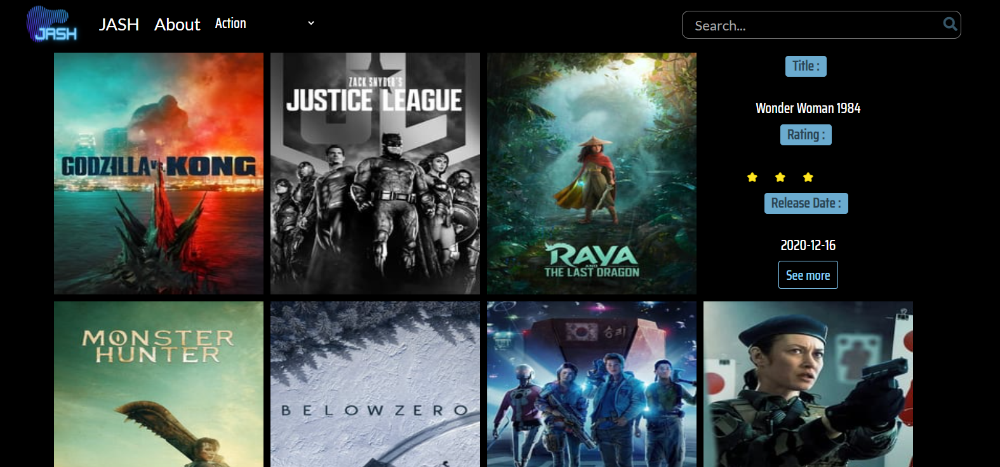
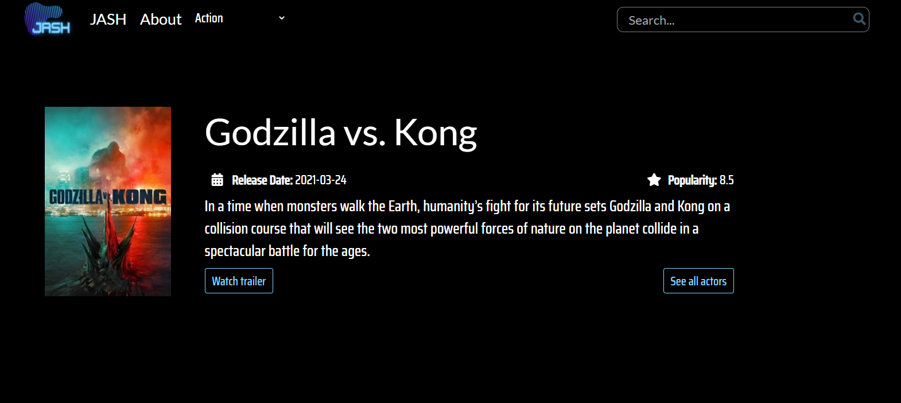

# JASH

JASH is a movie web based application, it shows all popular movies with their trailers.
Built with Reactjs and SemanticUI CSS

## Features

- Fetch and list popular movies
- Search movies by title or genres
- Filter movies by genres
- See more about a movie and watch the trailer

## Screenshots





## Installation & Run

Clone the Github repository and use npm to install the dependencies

```
git clone https://github.com/harkibit/JASH.git
cd movie-project
npm i
npm start
```

## MIT License

COPYRIGHT © 2021 MOVIE JASH
